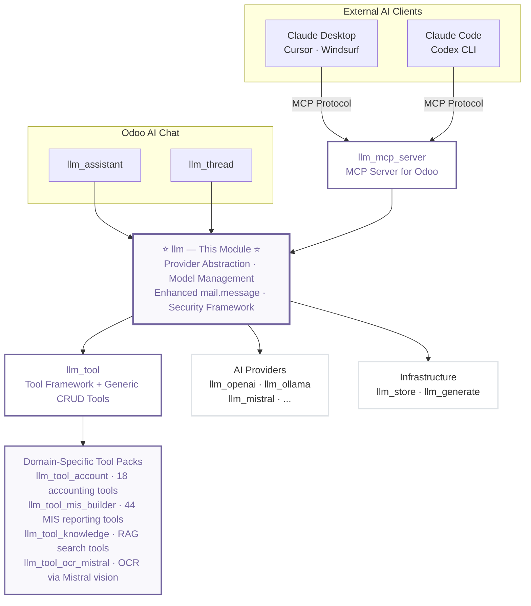

# LLM Integration Base for Odoo

The foundational module for integrating Large Language Models into Odoo. This base module provides the core infrastructure, provider abstraction, and enhanced messaging system that enables all other LLM modules in the ecosystem.

**Module Type:** 📦 Infrastructure (Core Foundation)

## Architecture



## Installation

### What to Install

This module is **auto-installed** as a dependency. You typically don't install it directly. **Choose a setup below based on your use case.**

### Common Setups

| I want to...                                 | Install                                                 |
| -------------------------------------------- | ------------------------------------------------------- |
| **Use Claude/Cursor/Codex with Odoo (MCP)**  | `llm_mcp_server` (+ tool packs below)                   |
| Chat with AI inside Odoo                     | `llm_assistant` + `llm_openai`                          |
| Use local AI (privacy)                       | `llm_assistant` + `llm_ollama`                          |
| Add RAG/knowledge base                       | Above + `llm_knowledge` + `llm_pgvector`                |
| AI-powered accounting via MCP or chat        | `llm_tool_account` (+ `llm_mcp_server` for external AI) |
| AI-powered financial reporting (MIS Builder) | `llm_tool_mis_builder` (+ `llm_mcp_server`)             |

### MCP Server — Connect External AI Clients

The **`llm_mcp_server`** module exposes all your Odoo tools to external AI clients via the [Model Context Protocol (MCP)](https://modelcontextprotocol.io/). This lets you use **Claude Desktop**, **Claude Code**, **Cursor**, **Windsurf**, **VS Code**, and **Codex CLI** to interact directly with your Odoo data.

```bash
odoo-bin -d your_db -i llm_mcp_server
```

After installing, each user generates their own API key from **My Profile → Account Security → New MCP Key**. The wizard provides ready-to-paste configurations for each client. See the [llm_mcp_server README](../llm_mcp_server/README.md) for full setup instructions.

### Domain-Specific Tool Packs

Install tool packs to give AI assistants (both in-Odoo and external MCP clients) specialized capabilities:

| Module                     | Tools | Description                                                                |
| -------------------------- | ----- | -------------------------------------------------------------------------- |
| **`llm_tool_account`**     | 18    | Trial balance, journal entries, reconciliation, payments, tax reports, P&L |
| **`llm_tool_mis_builder`** | 44    | KPI management, report computation, drill-down, variance analysis, trends  |
| **`llm_tool_knowledge`**   | —     | RAG search, semantic retrieval, source citations from your knowledge base  |
| **`llm_tool_ocr_mistral`** | 1     | Extract text from images and PDFs using Mistral AI vision models           |
| **`llm_tool_demo`**        | 6     | Example tools showing `@llm_tool` decorator patterns for developers        |

The base `llm_tool` module also includes 6 **generic CRUD tools** out of the box: `odoo_record_retriever`, `odoo_record_creator`, `odoo_record_updater`, `odoo_record_unlinker`, `odoo_model_method_executor`, and `odoo_model_inspector` — enabling AI to read, create, update, and delete records in any Odoo model.

### This Module Provides

- Provider abstraction framework
- Model and publisher management
- Enhanced `mail.message` with `llm_role` field
- Security groups and access control
- Base configuration menus

### Modules That Depend on This

| Category           | Modules                                                                                               |
| ------------------ | ----------------------------------------------------------------------------------------------------- |
| **MCP Server**     | `llm_mcp_server`                                                                                      |
| **Interfaces**     | `llm_assistant`, `llm_thread`                                                                         |
| **Tool Framework** | `llm_tool` → `llm_tool_account`, `llm_tool_mis_builder`, `llm_tool_knowledge`, `llm_tool_ocr_mistral` |
| **Providers**      | `llm_openai`, `llm_ollama`, `llm_mistral`, `llm_replicate`, `llm_fal_ai`                              |
| **Infrastructure** | `llm_store`, `llm_generate`                                                                           |

## Overview

The LLM Integration Base serves as the foundation for building AI-powered features across Odoo applications. It extends Odoo's core messaging system with AI-specific capabilities and provides a unified framework for connecting with various AI providers.

### Core Capabilities

- **Enhanced Messaging System** - AI-optimized message handling with 10x performance improvement
- **Provider Abstraction** - Unified interface for multiple AI services (OpenAI, Anthropic, Ollama, etc.)
- **Model Management** - Centralized catalog of AI models with capabilities and metadata
- **Publisher Tracking** - Management of AI model publishers and organizations
- **Security Framework** - Role-based access control and API key management

## Key Features

### Enhanced Mail Message System

The module extends Odoo's `mail.message` model with LLM-specific fields:

```python
# Performance-optimized role field (10x faster queries)
llm_role = fields.Selection([
    ('user', 'User'),
    ('assistant', 'Assistant'),
    ('tool', 'Tool'),
    ('system', 'System')
], compute='_compute_llm_role', store=True, index=True)

# Structured data for tool messages
body_json = fields.Json()
```

### AI Message Subtypes

Integrated message subtypes for AI interactions:

- **`llm.mt_user`**: User messages in AI conversations
- **`llm.mt_assistant`**: AI-generated responses
- **`llm.mt_tool`**: Tool execution results and data
- **`llm.mt_system`**: System prompts and configuration messages

### Provider Framework

Unified provider abstraction supporting multiple AI services:

```python
# Dynamic method dispatch to service implementations
provider._dispatch('chat', messages=messages, model=model)
provider._dispatch('embedding', text=text)
provider._dispatch('generate', prompt=prompt, type='image')
```

**Supported Providers:**

- **OpenAI** - GPT models, DALL-E, embeddings
- **Anthropic** - Claude models with tool calling
- **Ollama** - Local model deployment
- **Mistral** - Mistral AI models
- **LiteLLM** - Multi-provider proxy
- **Replicate** - Model marketplace
- **FAL.ai** - Fast inference API

### Model Management

Comprehensive model catalog with automatic discovery:

- **Model Registry**: Centralized tracking of available AI models
- **Capability Mapping**: Model features (chat, embedding, multimodal, etc.)
- **Publisher Management**: Organization tracking and official status
- **Auto-Discovery**: "Fetch Models" functionality for automatic import
- **Default Selection**: Configurable default models per use case

## Performance Improvements

### 10x Faster Message Queries

The new `llm_role` field provides dramatic performance improvements:

- **Before**: Complex subtype joins and computed fields
- **After**: Direct indexed field access
- **Result**: 10x faster conversation history queries

### Optimized Database Operations

- **Indexed Role Field**: Fast filtering and sorting of AI messages
- **Reduced Complexity**: Elimination of expensive role lookups
- **Efficient Pagination**: Optimized conversation history loading
- **Scalable Architecture**: Performance maintained with large datasets

## Getting Started

### Installation

1. Install the module in your Odoo instance
2. Verify dependencies are satisfied (`mail`, `web`)
3. Install provider modules for your preferred AI services

### Basic Configuration

1. **Set up AI Provider:**

   ```
   Navigate to: LLM → Configuration → Providers
   Create new provider with API credentials
   Click "Fetch Models" to import available models
   ```

2. **Configure Models:**

   ```
   Go to: LLM → Configuration → Models
   Set default models for chat, embedding, etc.
   Configure model parameters and capabilities
   ```

3. **Security Setup:**
   ```
   Assign users to LLM User or LLM Manager groups
   Configure API key access permissions
   Set up tool consent requirements
   ```

## Technical Specifications

### Module Information

- **Name**: LLM Integration Base
- **Version**: 18.0.1.4.0
- **Category**: Technical
- **License**: LGPL-3
- **Dependencies**: `mail`, `web`
- **Author**: Apexive Solutions LLC

### Key Models

#### `llm.provider`

Manages connections to AI service providers:

- API authentication and configuration
- Model discovery and import
- Service-specific implementations
- Usage tracking and monitoring

#### `llm.model`

Represents individual AI models:

- Model capabilities and parameters
- Publisher information and status
- Default model configuration
- Performance and cost metadata

#### `llm.publisher`

Tracks AI model publishers:

- Organization information
- Official status verification
- Model portfolio management
- Publisher-specific settings

#### `mail.message` (Extended)

Enhanced with LLM-specific fields:

- `llm_role`: Performance-optimized role tracking
- `body_json`: Structured data for tool messages
- Computed role from message subtypes
- AI-specific email handling

### Multimodal Attachments

The module supports sending file attachments to LLM providers via enhanced mail.message:

#### Supported File Types

| Category      | Mimetypes                                                           |
| ------------- | ------------------------------------------------------------------- |
| **Images**    | JPEG, PNG, GIF, WebP                                                |
| **Documents** | PDF                                                                 |
| **Text**      | Plain text, Markdown, CSV, HTML, CSS, JavaScript, XML, Python, JSON |

#### API Methods

```python
# Get formatted attachments from a message
images = message._get_image_attachments()  # Returns list of base64 images
pdfs = message._get_pdf_attachments()      # Returns list of base64 PDFs
texts = message._get_text_attachments()    # Returns decoded text content

# Prepare all attachments for multimodal LLM call
attachments = message._prepare_multimodal_attachments(is_multimodal=True)
# Returns: {"images": [...], "pdfs": [...], "texts": [...], "has_attachments": bool}
```

Non-multimodal models automatically skip images/PDFs while still processing text files.

### Database Schema

```sql
-- Performance optimization: indexed role field
ALTER TABLE mail_message ADD COLUMN llm_role VARCHAR;
CREATE INDEX idx_mail_message_llm_role ON mail_message(llm_role);

-- Structured data storage for tools
ALTER TABLE mail_message ADD COLUMN body_json JSONB;
```

## API Reference

### Provider Methods

```python
# Chat completion
response = provider.chat(
    messages=[{"role": "user", "content": "Hello"}],
    model="gpt-4",
    stream=False
)

# Text embedding
embedding = provider.embedding(
    text="Sample text to embed",
    model="text-embedding-ada-002"
)

# Content generation
content = provider.generate(
    prompt="A beautiful landscape",
    type="image",
    model="dall-e-3"
)
```

### Message Posting

```python
# AI-optimized message posting
thread.message_post(
    body="AI response content",
    llm_role="assistant",
    author_id=False
)

# Tool result with structured data
thread.message_post(
    body_json={
        "tool_call_id": "call_123",
        "function": "search_records",
        "result": {"count": 5, "records": [...]}
    },
    llm_role="tool"
)
```

## Integration Patterns

### Extending with New Providers

1. **Create Provider Module:**

   ```python
   class LLMProvider(models.Model):
       _inherit = "llm.provider"

       @api.model
       def _get_available_services(self):
           return super()._get_available_services() + [
               ('my_service', 'My AI Service')
           ]
   ```

2. **Implement Service Methods:**

   ```python
   def my_service_chat(self, messages, model=None, **kwargs):
       """Service-specific chat implementation"""
       # Implementation details

   def my_service_embedding(self, text, model=None, **kwargs):
       """Service-specific embedding implementation"""
       # Implementation details
   ```

### Custom Message Handling

```python
class CustomThread(models.Model):
    _inherit = "llm.thread"

    def message_post(self, **kwargs):
        # Custom pre-processing
        if kwargs.get('llm_role') == 'custom':
            # Handle custom role logic
            pass

        return super().message_post(**kwargs)
```

## Related Modules

Build complete AI solutions by combining with specialized modules:

### External AI Integration

- **`llm_mcp_server`**: MCP server exposing all Odoo tools to Claude Desktop, Claude Code, Cursor, Codex CLI, and any MCP-compatible client

### Tool Packs

- **`llm_tool`**: Tool framework with generic CRUD tools (retrieve, create, update, delete, inspect, execute)
- **`llm_tool_account`**: 18 AI-powered accounting tools — trial balance, journal entries, reconciliation, payments, tax reports, P&L, period close
- **`llm_tool_mis_builder`**: 44 tools for MIS Builder financial reporting — KPIs, periods, report computation, drill-down, variance analysis
- **`llm_tool_knowledge`**: RAG tools for semantic search, knowledge retrieval, and source citations
- **`llm_tool_ocr_mistral`**: OCR tool using Mistral vision models for invoices, receipts, scanned documents

### Chat & Assistants

- **`llm_assistant`**: AI assistants with custom prompts and personalities
- **`llm_thread`**: Chat interfaces and conversation management

### Infrastructure

- **`llm_generate`**: Unified content generation API
- **`llm_knowledge`**: RAG and knowledge base functionality
- **`llm_store`**: Vector storage and similarity search

## Support & Resources

- **Documentation**: [GitHub Repository](https://github.com/apexive/odoo-llm)
- **Architecture Guide**: [OVERVIEW.md](../OVERVIEW.md)
- **Community Support**: [GitHub Discussions](https://github.com/apexive/odoo-llm/discussions)
- **Bug Reports**: [GitHub Issues](https://github.com/apexive/odoo-llm/issues)

## License

This module is licensed under [LGPL-3](https://www.gnu.org/licenses/lgpl-3.0.html).

---

_© 2025 Apexive Solutions LLC. All rights reserved._
