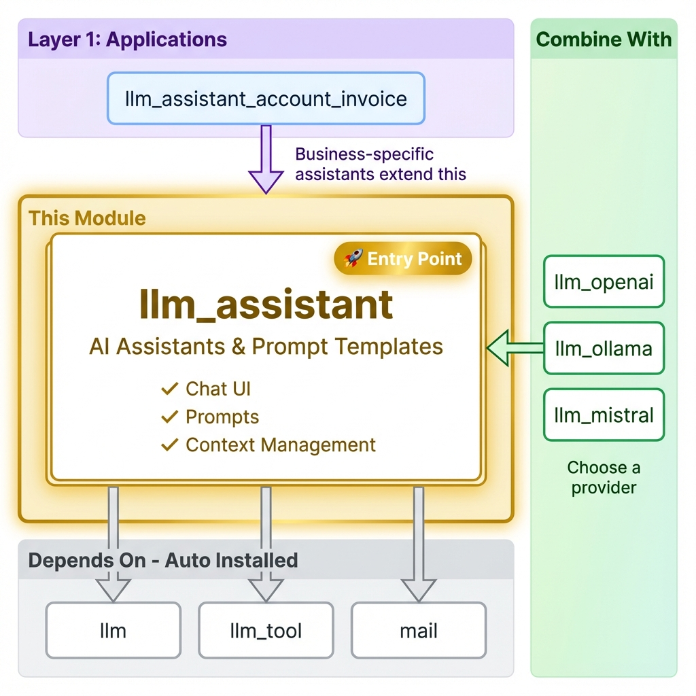

==============================
LLM Assistant for Odoo
==============================

Advanced AI assistant management with integrated prompt templates, testing capabilities, and intelligent configuration orchestration.

**Module Type:** 🚀 Entry Point

Installation
============

What to Install
---------------

This is the **main entry point** for AI chat features in Odoo.

**Basic AI Chat Setup:**

.. code-block:: bash

    odoo-bin -d your_db -i llm_assistant,llm_openai

Auto-Installed Dependencies
---------------------------

These are pulled in automatically:

- ``llm`` (core infrastructure)
- ``llm_tool`` (function calling)
- ``llm_thread`` (chat interface)
- ``mail`` (Odoo messaging)

Choose a Provider
-----------------

+----------+--------------+----------------------------+
| Provider | Module       | Best For                   |
+==========+==============+============================+
| OpenAI   | ``llm_openai`` | GPT-4, most capable       |
+----------+--------------+----------------------------+
| Ollama   | ``llm_ollama`` | Local/private, no API costs|
+----------+--------------+----------------------------+
| Mistral  | ``llm_mistral``| European, fast            |
+----------+--------------+----------------------------+

Common Setups
-------------

+----------------------------------+------------------------------------------------------+
| I want to...                     | Install                                              |
+==================================+======================================================+
| Chat with GPT-4 in Odoo          | ``llm_assistant`` + ``llm_openai``                   |
+----------------------------------+------------------------------------------------------+
| Use local AI (privacy)           | ``llm_assistant`` + ``llm_ollama``                   |
+----------------------------------+------------------------------------------------------+
| Add document search (RAG)        | Above + ``llm_knowledge`` + ``llm_pgvector``         |
+----------------------------------+------------------------------------------------------+
| Connect Claude Desktop           | Above + ``llm_mcp_server``                           |
+----------------------------------+------------------------------------------------------+
| Build domain-specific assistant  | Extend (see ``llm_assistant_account_invoice``)       |
+----------------------------------+------------------------------------------------------+

Overview
========

The LLM Assistant module provides sophisticated AI assistant management that goes far beyond simple chatbots. It serves as the intelligent configuration layer that orchestrates how AI models interact with Odoo data.

Core Capabilities
-----------------

- **AI Assistant Configuration** - Define specialized AI personas with specific roles
- **Integrated Prompt Management** - Consolidated prompt template system
- **Template Testing** - Built-in testing wizard for prompt validation
- **Context Orchestration** - Intelligent mapping between Odoo data and AI inputs
- **Tool Management** - Configure available tools and their usage patterns

Key Features
============

Consolidated Architecture
-------------------------

- Prompt templates integrated into assistant management
- Enhanced testing wizard with context simulation
- Streamlined UI with unified assistant and prompt selection
- Auto-argument detection for template variables
- Schema synchronization between templates and forms

Assistant Types
---------------

Chat Assistants
~~~~~~~~~~~~~~~

.. code-block:: python

    assistant = env['llm.assistant'].create({
        'name': 'Customer Support Bot',
        'role': 'Customer Service Representative',
        'goal': 'Provide helpful and accurate customer support',
        'background': 'Expert in our products with access to CRM data',
        'instructions': '''
            - Always be polite and professional
            - Use customer history for personalized responses
            - Escalate complex issues to human agents
        ''',
        'tool_ids': [(6, 0, [crm_tool.id, knowledge_tool.id])]
    })

Content Generation Assistants
~~~~~~~~~~~~~~~~~~~~~~~~~~~~~

.. code-block:: python

    assistant = env['llm.assistant'].create({
        'name': 'Marketing Content Creator',
        'role': 'Marketing Specialist',
        'goal': 'Create compelling marketing content',
        'prompt_id': marketing_template.id,
    })

Prompt Template System
======================

Template Management
-------------------

.. code-block:: python

    prompt = env['llm.prompt'].create({
        'name': 'Sales Email Generator',
        'template': '''
    Generate a personalized sales email for {{customer_name}}
    regarding {{product_name}}.

    Customer Context:
    - Company: {{customer_company}}
    - Industry: {{industry}}

    Email should be {{tone}} and focus on {{key_benefits}}.
        ''',
        'format': 'text',
    })

    # Arguments automatically detected
    prompt.auto_detect_arguments()

Testing & Validation
--------------------

.. code-block:: python

    wizard = env['llm.assistant.test.wizard'].create({
        'assistant_id': assistant.id,
        'test_context': {
            'customer_name': 'John Smith',
            'product_name': 'Enterprise Software'
        }
    })

Configuration Guide
===================

Basic Setup
-----------

1. **Set up AI Provider:**

   Navigate to **LLM → Configuration → Providers**:

   - Create a new provider with your API credentials
   - Click **Fetch Models** to import available models

2. **Create AI Assistants:**

   Go to **LLM → Configuration → Assistants**:

   - Configure assistants with specific roles
   - Assign prompt templates and available tools

3. **Start Chatting:**

   Navigate to **LLM → Chat** to start conversations

API Reference
=============

Assistant Methods
-----------------

.. code-block:: python

    # Get system prompt with context
    system_prompt = assistant.get_system_prompt(context={
        'customer_name': 'John Doe'
    })

    # Prepare conversation context
    context = assistant.prepare_context(
        record=sale_order,
        user_input="Tell me about pricing"
    )

    # Get available tools
    tools = assistant.get_available_tools()

Technical Specifications
========================

Module Information
------------------

- **Name**: LLM Assistant
- **Version**: 18.0.1.5.0
- **Category**: Productivity
- **License**: LGPL-3
- **Dependencies**: ``llm``, ``mail``
- **Author**: Apexive Solutions LLC

Key Models
----------

- **``llm.assistant``**: Main assistant configuration
- **``llm.prompt``**: Integrated prompt template management
- **``llm.prompt.category``**: Template categorization
- **``llm.assistant.test.wizard``**: Testing and validation

Related Modules
===============

- **``llm``** - Base infrastructure and provider management
- **``llm_thread``** - Chat interfaces and conversation management
- **``llm_tool``** - Function calling and Odoo integration
- **``llm_generate``** - Content generation with assistant integration
- **``llm_knowledge``** - RAG and knowledge base integration
- **``llm_assistant_account_invoice``** - Example domain-specific assistant

Resources
=========

- `GitHub Repository <https://github.com/apexive/odoo-llm>`_
- `Architecture Overview <../OVERVIEW.md>`_

License
=======

This module is licensed under `LGPL-3 <https://www.gnu.org/licenses/lgpl-3.0.html>`_.

----

*© 2025 Apexive Solutions LLC. All rights reserved.*
