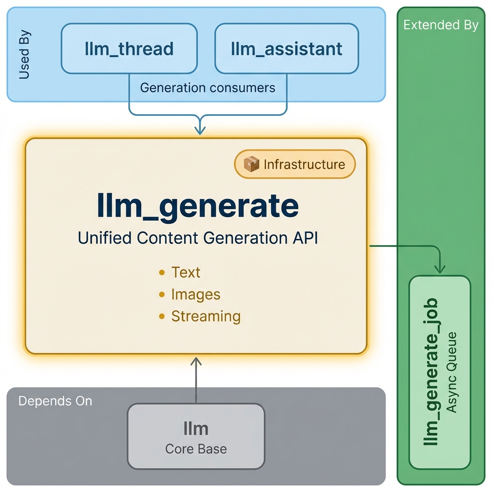

==============================
LLM Generate for Odoo
==============================

Unified content generation system with dynamic form generation, streaming responses, and comprehensive error handling.

**Module Type:** 📦 Infrastructure

Installation
============

What to Install
---------------

This module is typically **auto-installed** as a dependency of ``llm_thread`` or ``llm_assistant``.

**For content generation features:**

.. code-block:: bash

    odoo-bin -d your_db -i llm_assistant,llm_openai

Auto-Installed Dependencies
---------------------------

These are pulled in automatically:

- ``llm`` (core infrastructure)
- ``llm_assistant`` (assistant framework)
- ``mail`` (Odoo messaging)

Optional Enhancements
---------------------

+---------------------+----------------------------------------------+
| Module              | Adds                                         |
+=====================+==============================================+
| ``llm_generate_job`` | Background job queue for long generations   |
+---------------------+----------------------------------------------+
| ``llm_fal_ai``       | Fast image generation                       |
+---------------------+----------------------------------------------+
| ``llm_replicate``    | Model marketplace access                    |
+---------------------+----------------------------------------------+

Common Setups
-------------

+-------------------------+------------------------------------------------+
| I want to...            | Install                                        |
+=========================+================================================+
| Generate text with GPT  | ``llm_assistant`` + ``llm_openai``             |
+-------------------------+------------------------------------------------+
| Generate images         | ``llm_assistant`` + ``llm_fal_ai``             |
+-------------------------+------------------------------------------------+
| Background generation   | Above + ``llm_generate_job``                   |
+-------------------------+------------------------------------------------+

Overview
========

The LLM Generate module serves as the unified interface for all content generation operations in the Odoo LLM ecosystem. It provides a consistent API regardless of the underlying AI provider or content type.

Core Capabilities
-----------------

- **Unified Generation API** - Single interface for text, image, audio, and other content types
- **Dynamic Form Generation** - Automatic UI generation based on model schemas
- **Streaming Generation** - Real-time content creation with live updates
- **Race Condition Fixes** - Comprehensive async handling and loading state management
- **Schema Handling** - Intelligent schema resolution and form field generation

Key Features
============

Unified Generation Interface
----------------------------

.. code-block:: python

    # Text generation
    response = thread.generate_response(
        user_input="Write a product description",
        generation_type="text"
    )

    # Image generation
    image = thread.generate_response(
        user_input="A beautiful landscape",
        generation_type="image",
        model_id=dalle_model.id
    )

Dynamic Form Generation
-----------------------

The system automatically generates forms based on AI model input schemas:

.. code-block:: python

    def get_input_schema(self):
        """Generate form schema with intelligent priority resolution"""
        # Priority: Assistant prompt > Thread prompt > Model default
        if self.assistant_id and self.assistant_id.prompt_id:
            return self.assistant_id.prompt_id.input_schema_json
        elif self.prompt_id:
            return self.prompt_id.input_schema_json
        else:
            return self.model_id.get_default_schema()

Streaming Generation
--------------------

.. code-block:: python

    def generate_response_stream(self, user_input, **kwargs):
        """Generate content with real-time streaming updates"""
        message = self.message_post(body="", llm_role="assistant")

        stream = self.provider_id.generate_stream(
            prompt=user_input,
            model=self.model_id.name
        )

        for chunk in stream:
            message.body += chunk.content
            self._notify_message_update(message)

        return message

Content Generation Types
========================

Text Generation
---------------

.. code-block:: python

    text_response = env['llm.thread'].generate_content(
        prompt="Write a professional email",
        content_type="text",
        parameters={'temperature': 0.7, 'max_tokens': 500}
    )

Image Generation
----------------

.. code-block:: python

    image_result = env['llm.thread'].generate_content(
        prompt="A modern office building at sunset",
        content_type="image",
        parameters={'size': '1024x1024', 'style': 'photorealistic'}
    )

API Reference
=============

Core Generation Methods
-----------------------

.. code-block:: python

    # Basic generation
    def generate_response(self, user_input, generation_type="text", **kwargs):
        """Main generation method with unified interface"""

    # Streaming generation
    def generate_response_stream(self, user_input, **kwargs):
        """Generate with real-time streaming updates"""

    # Template-based generation
    def generate_from_template(self, template_id, context, **kwargs):
        """Generate using prompt template with context"""

    # Batch generation
    def generate_batch(self, prompts, content_type, **kwargs):
        """Generate multiple items in batch"""

Technical Specifications
========================

Module Information
------------------

- **Name**: LLM Generate
- **Version**: 18.0.2.0.0
- **Category**: Productivity
- **License**: LGPL-3
- **Dependencies**: ``llm``, ``llm_assistant``, ``mail``
- **Author**: Apexive Solutions LLC

Key Models
----------

- **``llm.generation.job``**: Background generation job management
- **``llm.generation.queue``**: Provider-specific queue configuration
- **Extensions to ``llm.thread``**: Core generation methods

Frontend Components
-------------------

- **LLMMediaForm**: Dynamic form generation component
- **LLMGenerationWizard**: Generation parameter configuration
- **LLMStreamingDisplay**: Real-time content updates
- **LLMSchemaIndicator**: Schema source transparency

Related Modules
===============

- **``llm``** - Base infrastructure and provider framework
- **``llm_assistant``** - Assistant configuration and prompt templates
- **``llm_thread``** - Chat interface using generation
- **``llm_generate_job``** - Advanced job queue management
- **``llm_fal_ai``** - FAL.ai provider with fast image generation

Resources
=========

- `GitHub Repository <https://github.com/apexive/odoo-llm>`_
- `Architecture Overview <../OVERVIEW.md>`_

License
=======

This module is licensed under `LGPL-3 <https://www.gnu.org/licenses/lgpl-3.0.html>`_.

----

*© 2025 Apexive Solutions LLC. All rights reserved.*
