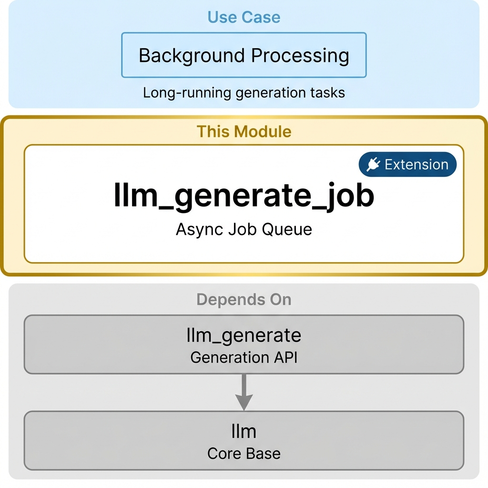

==============================
LLM Generate Job
==============================

Comprehensive generation job management system with queue management and job tracking capabilities for long-running AI tasks.

**Module Type:** 🔌 Extension

Installation
============

What to Install
---------------

Install this module when you need **background/async generation** for long-running tasks.

.. code-block:: bash

    odoo-bin -d your_db -i llm_generate_job

Auto-Installed Dependencies
---------------------------

These are pulled in automatically:

- ``llm_generate`` (generation API)
- ``llm_thread`` (chat interface)
- ``llm_tool`` (tool framework)
- ``llm`` (core infrastructure)

When to Use This Module
-----------------------

+----------------------------+------------------------------------------+
| Scenario                   | Recommendation                           |
+============================+==========================================+
| Quick chat responses       | Not needed - use direct generation       |
+----------------------------+------------------------------------------+
| Long document generation   | **Install this**                         |
+----------------------------+------------------------------------------+
| Batch image generation     | **Install this**                         |
+----------------------------+------------------------------------------+
| API rate limit management  | **Install this**                         |
+----------------------------+------------------------------------------+

Common Setups
-------------

+-----------------------------+------------------------------------------------------+
| I want to...                | Install                                              |
+=============================+======================================================+
| Background text generation  | ``llm_assistant`` + ``llm_openai`` + this module     |
+-----------------------------+------------------------------------------------------+
| Batch image processing      | ``llm_assistant`` + ``llm_fal_ai`` + this module     |
+-----------------------------+------------------------------------------------------+

Features
========

Generation Job Management
-------------------------

- **Job Lifecycle**: Complete job lifecycle management from creation to completion
- **Status Tracking**: Real-time job status (draft, queued, running, completed, failed, cancelled)
- **Retry Logic**: Automatic and manual retry capabilities for failed jobs
- **Error Handling**: Comprehensive error tracking and reporting

Queue Management
----------------

- **Provider-specific Queues**: Each LLM provider has its own dedicated queue
- **Concurrent Job Control**: Configurable maximum concurrent jobs per provider
- **Queue Health Monitoring**: Real-time queue health indicators
- **Performance Metrics**: Queue performance analytics and success rates

Usage
=====

Basic Usage
-----------

.. code-block:: python

    # Direct generation (backward compatible)
    thread = self.env['llm.thread'].browse(thread_id)
    for update in thread.generate_response("Hello", use_queue=False):
        print(update)

    # Queued generation
    for update in thread.generate_response("Hello", use_queue=True):
        print(update)

    # Auto-detection (recommended)
    for update in thread.generate_response("Hello"):
        # Automatically chooses based on provider capabilities
        print(update)

Job Management
--------------

.. code-block:: python

    # Create a job
    job = self.env['llm.generation.job'].create({
        'thread_id': thread_id,
        'provider_id': provider_id,
        'model_id': model_id,
        'generation_inputs': {'prompt': 'Hello world'},
    })

    # Queue and start the job
    job.action_queue()

    # Monitor job status
    while job.state in ['queued', 'running']:
        status = job.check_status()
        print(f"Job {job.id} is {job.state}")

Architecture
============

Models
------

``llm.generation.job``
~~~~~~~~~~~~~~~~~~~~~~

The main model for managing individual generation jobs:

- **Relationships**: Links to thread, provider, model, and messages
- **Status Management**: Job state transitions and lifecycle management
- **Timing**: Queue time, processing time, and completion tracking

``llm.generation.queue``
~~~~~~~~~~~~~~~~~~~~~~~~

Provider-specific queue management:

- **Configuration**: Maximum concurrent jobs, auto-retry settings
- **Monitoring**: Real-time job counts and queue health
- **Performance**: Success rates and processing time analytics

Monitoring
==========

Queue Health
------------

Queues are automatically monitored for:

- **Healthy**: Normal operation
- **Warning**: High load but functioning
- **Critical**: Overloaded or failing
- **Disabled**: Manually disabled

Performance Metrics
-------------------

- **Average Queue Time**: Time jobs spend waiting
- **Average Processing Time**: Time jobs spend processing
- **Success Rate**: Percentage of successful jobs
- **Throughput**: Jobs processed per time period

Cron Jobs
---------

- **Process Queues**: Automatically process pending jobs (every minute)
- **Check Job Status**: Update running job statuses (every 30 seconds)
- **Auto-retry Failed Jobs**: Retry eligible failed jobs (every 5 minutes)
- **Cleanup Old Jobs**: Remove old completed jobs (daily)

Technical Specifications
========================

Module Information
------------------

- **Name**: LLM Generate Job
- **Version**: 18.0.1.0.0
- **Category**: Productivity
- **License**: LGPL-3
- **Dependencies**: ``llm_thread``, ``llm_tool``
- **Author**: Apexive Solutions LLC

Related Modules
===============

- **``llm_generate``** - Core generation API (dependency)
- **``llm_thread``** - Chat interface integration
- **``llm_assistant``** - Assistant configuration
- **``llm_fal_ai``** - Provider with job-based generation

Resources
=========

- `GitHub Repository <https://github.com/apexive/odoo-llm>`_

License
=======

This module is licensed under `LGPL-3 <https://www.gnu.org/licenses/lgpl-3.0.html>`_.

----

*© 2025 Apexive Solutions LLC. All rights reserved.*
