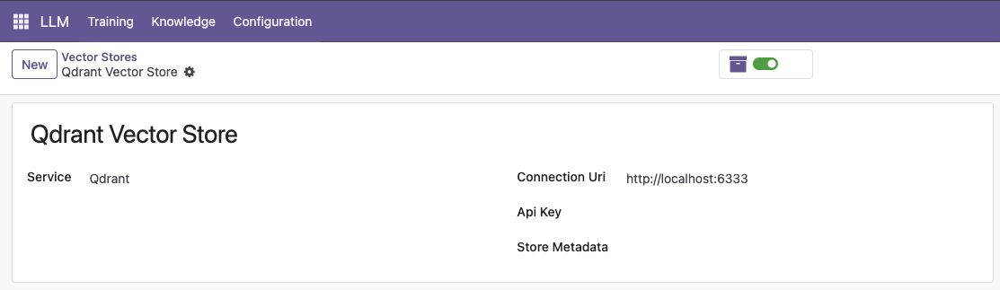
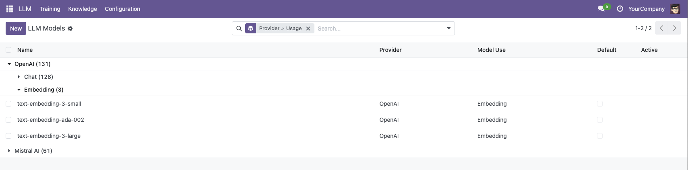
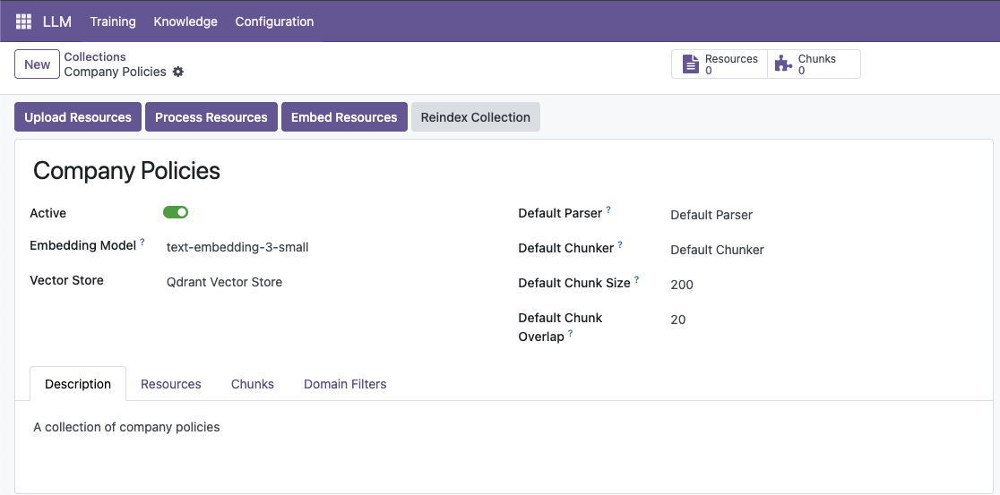
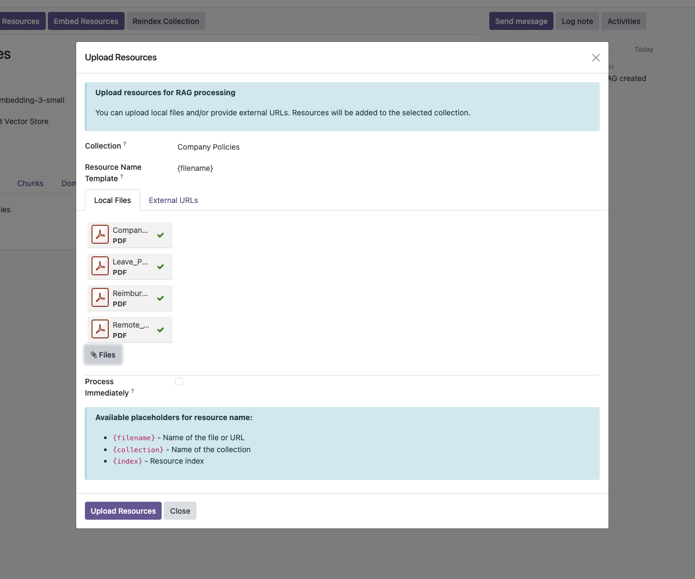
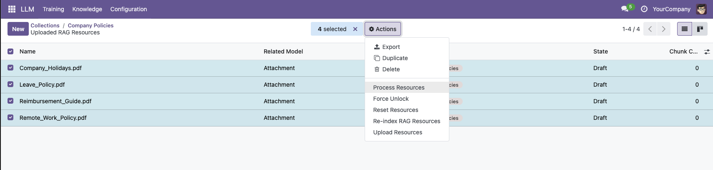
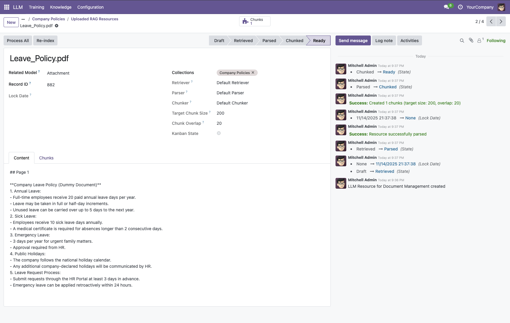
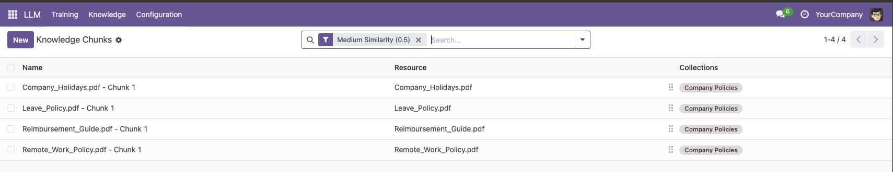
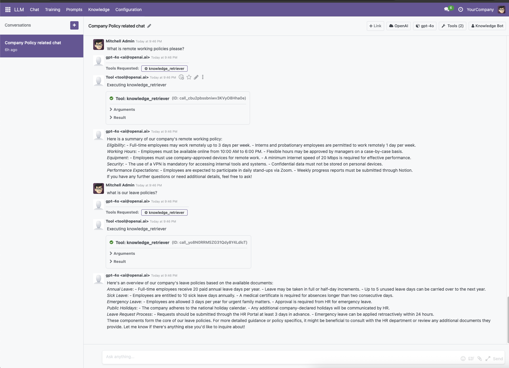

# LLM Knowledge

RAG (Retrieval-Augmented Generation) system for Odoo. Document processing, vector storage, and semantic search with multiple vector store backends.

**Module Type:** 📦 Infrastructure (RAG System)

## Architecture

```
┌───────────────────────────────────────────────────────────────┐
│                    Application Layer                          │
│        ┌───────────────┐           ┌───────────────┐         │
│        │ llm_assistant │           │  Claude/MCP   │         │
│        │  (Chat + RAG) │           │   Clients     │         │
│        └───────┬───────┘           └───────┬───────┘         │
└────────────────┼───────────────────────────┼─────────────────┘
                 └─────────────┬─────────────┘
                               ▼
              ┌───────────────────────────────────────────┐
              │      ★ llm_knowledge (This Module) ★      │
              │            RAG Infrastructure             │
              │  📄 Documents │ 🔍 Search │ 📚 Collections │
              └─────────────────────┬─────────────────────┘
                        ┌───────────┴───────────┐
                        ▼                       ▼
    ┌───────────────────────────┐   ┌───────────────────────────┐
    │         llm_store         │   │     Vector Store          │
    │   (Vector Store API)      │   │ pgvector/qdrant/chroma    │
    └───────────────────────────┘   └───────────────────────────┘
                        │
                        ▼
              ┌───────────────────────────────────────────┐
              │                   llm                     │
              │            (Core Base Module)             │
              └───────────────────────────────────────────┘
```

## Installation

### What to Install

**For RAG capabilities:**

```bash
# Install with a vector store (choose one)
odoo-bin -d your_db -i llm_knowledge,llm_pgvector

# Or with Qdrant
odoo-bin -d your_db -i llm_knowledge,llm_qdrant
```

### Auto-Installed Dependencies

- `llm` (core infrastructure)
- `llm_store` (vector store abstraction)

### Why Use This Module?

| Feature      | llm_knowledge                  |
| ------------ | ------------------------------ |
| **RAG**      | 📚 Ground AI in your documents |
| **Search**   | 🔍 Semantic similarity search  |
| **Sources**  | 📄 Cite document sources       |
| **Flexible** | 🔌 Multiple vector backends    |

### Common Setups

| I want to... | Install                                                           |
| ------------ | ----------------------------------------------------------------- |
| Basic RAG    | `llm_knowledge` + `llm_pgvector`                                  |
| Chat + RAG   | `llm_assistant` + `llm_openai` + `llm_knowledge` + `llm_pgvector` |
| Advanced RAG | Above + `llm_knowledge_llama`                                     |
| Image OCR    | Above + `llm_knowledge_mistral`                                   |
| Auto-sync    | Above + `llm_knowledge_automation`                                |

## What is RAG?

Retrieval-Augmented Generation enhances LLM responses by retrieving relevant context from your documents before generating answers. Instead of relying solely on the model's training data, RAG:

1. **Retrieves** relevant document chunks using semantic search
2. **Augments** the LLM prompt with retrieved context
3. **Generates** responses grounded in your actual documents

This enables LLMs to answer questions about your specific data with source citations, reducing hallucinations and providing verifiable information.

---

## Installation

### Prerequisites

- **Odoo**: 18.0 or higher
- **Required Modules**: `llm`, `llm_store`
- **Python Packages**: `requests`, `markdownify`, `PyMuPDF`, `numpy`
- **Vector Store**: One of `llm_qdrant`, `llm_pgvector`, or `llm_chroma`

### Install Steps

1. **Install Python dependencies:**

   ```bash
   pip install requests markdownify PyMuPDF numpy
   ```

2. **Install required Odoo modules:**

   ```bash
   # Install base modules first
   odoo-bin -d your_database -i llm,llm_store

   # Install a vector store (choose one)
   odoo-bin -d your_database -i llm_qdrant  # or llm_pgvector or llm_chroma

   # Install llm_knowledge
   odoo-bin -d your_database -i llm_knowledge
   ```

3. **Restart Odoo server**

---

## Quick Start (5 Minutes)

### 1. Create a Knowledge Collection

```python
# Access Odoo shell
odoo-bin shell -d your_database

# Create collection
collection = env['llm.knowledge.collection'].create({
    'name': 'Product Documentation',
    'store_id': env['llm.store'].search([('store_type', '=', 'qdrant')], limit=1).id,
    'embedding_model_id': env['llm.model'].search([('name', '=', 'text-embedding-3-small')], limit=1).id,
    'chunk_size': 1000,
    'chunk_overlap': 200,
})

# Create vector collection in store
collection.create_vector_collection()
```

### 2. Add a Document

```python
# Add from URL
resource = env['llm.resource'].create({
    'name': 'Product Manual',
    'url': 'https://example.com/manual.pdf',
    'resource_type': 'url',
    'collection_ids': [(4, collection.id)],
})

# Process the document
resource.process_resource()  # retrieve → parse → chunk → embed
```

### 3. Search Your Knowledge

```python
# Search collection
results = env['llm.knowledge.chunk'].search(
    args=[('embedding', '=', 'How do I reset my password?')],
    limit=5,
    collection_id=collection.id
)

# Print results
for chunk in results:
    print(f"Score: {chunk.similarity:.2f}")
    print(f"Source: {chunk.resource_id.name}")
    print(f"Content: {chunk.content[:200]}...")
    print("---")
```

---

## Usage Examples

### Add Document from File Upload

```python
# Via attachment
attachment = env['ir.attachment'].create({
    'name': 'company_policy.pdf',
    'datas': base64.b64encode(open('/path/to/file.pdf', 'rb').read()),
})

resource = env['llm.resource'].create({
    'name': 'Company Policy',
    'resource_type': 'attachment',
    'attachment_id': attachment.id,
    'collection_ids': [(4, collection.id)],
})

resource.process_resource()
```

### Add Web Page Content

```python
# Fetch and parse web page
resource = env['llm.resource'].create({
    'name': 'Technical Documentation',
    'url': 'https://docs.example.com/api',
    'resource_type': 'url',
    'collection_ids': [(4, collection.id)],
})

resource.process_resource()
```

### Batch Process Multiple Documents

```python
# Create multiple resources
urls = [
    'https://example.com/doc1.pdf',
    'https://example.com/doc2.pdf',
    'https://example.com/doc3.pdf',
]

resources = env['llm.resource'].create([
    {
        'name': f'Document {i+1}',
        'url': url,
        'resource_type': 'url',
        'collection_ids': [(4, collection.id)],
    }
    for i, url in enumerate(urls)
])

# Process all at once
collection.process_all_resources()
```

### Use with LLM Assistant

```python
# Create RAG-enabled assistant
assistant = env['llm.assistant'].create({
    'name': 'Product Support Bot',
    'provider_id': env.ref('llm_openai.provider_openai').id,
    'model_id': env['llm.model'].search([('name', '=', 'gpt-4')], limit=1).id,
})

# Add knowledge tool
tool = env['llm.tool'].create({
    'name': 'search_product_docs',
    'implementation': 'knowledge_retriever',
    'collection_ids': [(4, collection.id)],
})

assistant.tool_ids = [(4, tool.id)]

# Chat with knowledge-enhanced assistant
thread = env['llm.thread'].create({'assistant_id': assistant.id})
thread.generate_response("How do I configure the API endpoint?")
```

---

## Screenshots Tutorial

Visual step-by-step guide showing the complete RAG setup:

### 1. Setup Vector Store


_Navigate to LLM → Stores to configure Qdrant, pgvector, or Chroma_


_Configure connection: host, port, API key_

### 2. Configure Embedding Model


_Select text-embedding-3-small or other embedding model_

### 3. Create Collection


_Link vector store and embedding model_

### 4. Upload & Process Documents


_Upload files, provide URLs, or fetch from web pages_


_View uploaded documents and trigger processing_


_Watch the pipeline: Parse → Chunk → Embed_


_Inspect generated chunks with embeddings_

### 5. Query with Assistant


_Chat with knowledge-enhanced assistant_

### 6. Use with External Apps


_Query from Claude Desktop, Cursor, or other MCP-compatible apps_

---

## Configuration

### Collection Settings

```python
# Chunking configuration
collection.chunk_size = 1000        # Max tokens per chunk
collection.chunk_overlap = 200      # Overlap between chunks

# Embedding configuration
collection.embedding_model_id = embedding_model  # Which model to use
collection.store_id = vector_store                # Which vector store
```

### Processing Pipeline States

| State       | Description           | Next Action  |
| ----------- | --------------------- | ------------ |
| `draft`     | Initial state         | `retrieve()` |
| `retrieved` | Content fetched       | `parse()`    |
| `parsed`    | Converted to markdown | `chunk()`    |
| `chunked`   | Split into segments   | `embed()`    |
| `ready`     | Embeddings stored     | Search/Query |

### Environment Variables

```bash
# Optional: Configure default settings
ODOO_LLM_CHUNK_SIZE=1000
ODOO_LLM_CHUNK_OVERLAP=200
ODOO_LLM_DEFAULT_EMBEDDING_MODEL=text-embedding-3-small
```

---

## Models Reference

### `llm.knowledge.collection`

**Responsibility:** Manages knowledge collections, coordinates document processing, and handles vector store integration.

**Key Methods:**

- `create_vector_collection()` - Create corresponding collection in vector store
- `process_all_resources()` - Process all documents in collection
- `search_content(query, limit=10)` - Search collection with semantic query
- `add_resources(resource_ids)` - Add resources to collection
- `remove_resources(resource_ids)` - Remove resources from collection
- `get_statistics()` - Get collection statistics (resource count, chunk count, etc.)

### `llm.resource`

**Responsibility:** Handles document retrieval, parsing, state management, and content extraction from various sources.

**Key Methods:**

- `process_resource()` - Run complete pipeline (retrieve → parse → chunk → embed)
- `retrieve()` - Fetch content from source (URL, attachment, text)
- `parse()` - Convert raw content to markdown
- `chunk()` - Split parsed content into chunks
- `embed()` - Generate embeddings for chunks
- `reset_to_state(state)` - Reset resource to specific processing state
- `lock_resource()` - Lock resource during processing
- `unlock_resource()` - Unlock resource after processing

**Fields:**

- `state` - Processing state (draft/retrieved/parsed/chunked/ready)
- `resource_type` - Source type (url/attachment/text)
- `content` - Raw retrieved content
- `markdown_content` - Parsed markdown content
- `collection_ids` - Associated collections

### `llm.knowledge.chunk`

**Responsibility:** Represents individual text chunks with embeddings and metadata for vector search.

**Key Methods:**

- `generate_embedding()` - Generate and store embedding for chunk
- `search(query, limit, collection_id)` - Semantic search (overridden search method)

**Fields:**

- `content` - Chunk text content
- `chunk_index` - Position in original document
- `vector_id` - ID in vector store
- `embedding_model_id` - Model used for embedding
- `token_count` - Number of tokens in chunk
- `similarity` - Search similarity score (computed)

### `llm.resource.parser`

**Responsibility:** Converts various document formats (PDF, HTML, DOCX) to clean markdown.

**Key Methods:**

- `parse_to_markdown(content, content_type)` - Main parsing entry point
- `parse_pdf(pdf_bytes)` - Extract and parse PDF content
- `parse_html(html_content)` - Convert HTML to markdown
- `clean_markdown(markdown)` - Clean up markdown formatting

### `llm.knowledge.retriever`

**Responsibility:** Handles semantic search and context retrieval for RAG operations.

**Key Methods:**

- `search_knowledge(query, collection_ids, limit, min_score)` - Search across collections
- `get_relevant_context(query, max_tokens)` - Get context for RAG generation
- `rank_results(results)` - Re-rank search results

---

## Optional Extensions

### Image Parsing with Mistral OCR

Install `llm_knowledge_mistral` to extract text from images, receipts, and handwritten notes:

```bash
odoo-bin -d your_database -i llm_knowledge_mistral
```

**Capabilities:**

- Handwritten notes
- Receipts and invoices
- Screenshots
- Scanned documents
- Product labels

### Automated Knowledge Sync

Install `llm_knowledge_automation` for automatic document updates:

```bash
odoo-bin -d your_database -i llm_knowledge_automation
```

### Alternative Vector Stores

- **llm_pgvector** - PostgreSQL with pgvector extension (SQL-based)
- **llm_chroma** - Lightweight embedded vector database
- **llm_qdrant** - High-performance vector search engine

---

## Documentation

- **Full Documentation**: `doc/index.rst`
- **GitHub Repository**: [https://github.com/apexive/odoo-llm](https://github.com/apexive/odoo-llm)
- **Module Manifest**: `__manifest__.py`

---

## License

This module is licensed under [LGPL-3](https://www.gnu.org/licenses/lgpl-3.0.html).

---

**© 2025 Apexive Solutions LLC. All rights reserved.**
