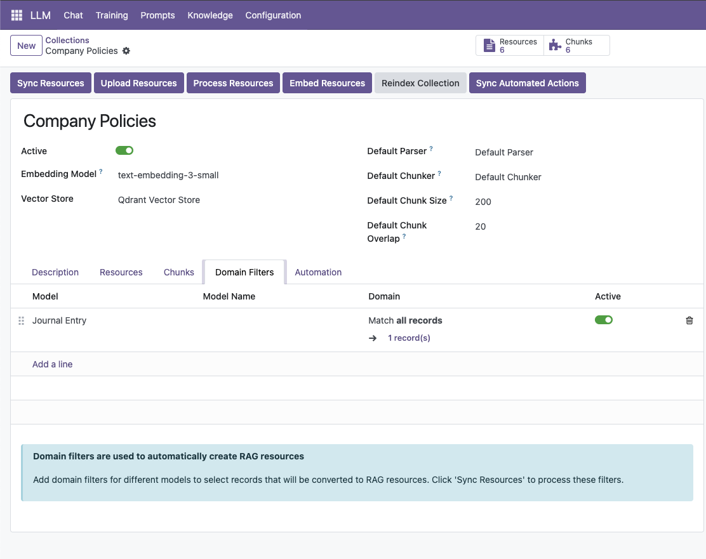
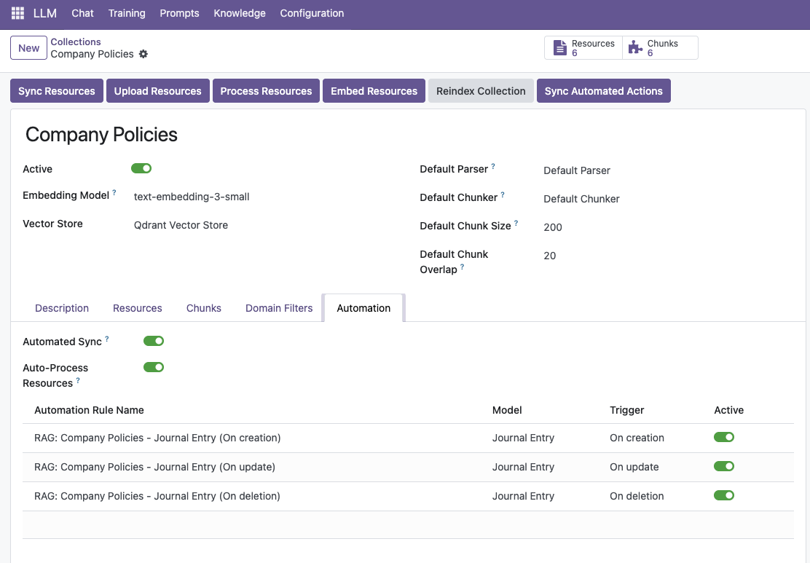

# LLM Knowledge Automation

**Set it and forget it** - Your AI's knowledge stays automatically updated as your data changes.

**Module Type:** 🔌 Extension (Auto-Sync RAG)

## Architecture

```
┌───────────────────────────────────────────────────────────────┐
│                     Odoo Data Changes                         │
│  ┌─────────────┐  ┌─────────────┐  ┌─────────────────────┐   │
│  │   Create    │  │   Update    │  │       Delete        │   │
│  └──────┬──────┘  └──────┬──────┘  └──────────┬──────────┘   │
└─────────┼────────────────┼────────────────────┼──────────────┘
          └────────────────┼────────────────────┘
                           ▼
              ┌───────────────────────────────────────────┐
              │ ★ llm_knowledge_automation (This Module) ★│
              │        Automated Sync Engine              │
              │  🔄 Auto-Create │ Auto-Update │ Auto-Remove│
              └─────────────────────┬─────────────────────┘
                                    │
                        ┌───────────┴───────────┐
                        ▼                       ▼
    ┌───────────────────────────┐   ┌───────────────────────────┐
    │      base_automation      │   │       llm_knowledge       │
    │    (Odoo Triggers)        │   │      (RAG Pipeline)       │
    └───────────────────────────┘   └───────────────────────────┘
```

## Installation

### What to Install

**For automated knowledge sync:**

```bash
odoo-bin -d your_db -i llm_knowledge_automation
```

### Auto-Installed Dependencies

- `llm` (core infrastructure)
- `llm_knowledge` (RAG infrastructure)
- `base_automation` (Odoo automation)

### Why Use This Module?

| Feature         | llm_knowledge_automation        |
| --------------- | ------------------------------- |
| **Auto-Create** | ➕ New records → knowledge base |
| **Auto-Update** | 🔄 Changes sync in real-time    |
| **Auto-Remove** | ➖ Deleted records cleaned up   |
| **Zero Manual** | 🤖 No manual sync needed        |

### Common Setups

| I want to...       | Install                                                                      |
| ------------------ | ---------------------------------------------------------------------------- |
| Auto-sync products | `llm_knowledge_automation` + `llm_pgvector`                                  |
| Auto-sync + chat   | `llm_assistant` + `llm_openai` + `llm_knowledge_automation` + `llm_pgvector` |

Automated knowledge synchronization for Odoo LLM. No manual sync required. Domain filters automatically create, update, and remove documents from knowledge collections when records change. RAG pipeline runs automatically.

## Overview

This module extends `llm_knowledge` with automated synchronization capabilities. Instead of manually syncing records to your knowledge base, you define domain filters once and the system handles everything automatically.

### The Problem

Without automation:

- You update a product price → AI still tells customers the old price
- You publish a new FAQ → Need to manually add it to knowledge base
- You archive a document → AI might still reference outdated info
- Team wastes time manually syncing data

### The Solution

With automation enabled:

- Create a record → Automatically added to knowledge base
- Update a record → Knowledge base updates in real-time
- Delete a record → Automatically removed from knowledge base
- Zero manual work required

## Features

### Automated Lifecycle Management

- **Auto-Create**: New records matching domain filters are automatically added to collections
- **Auto-Update**: Record changes sync to knowledge base in real-time
- **Auto-Remove**: Deleted records or records no longer matching filters are removed
- **Auto-Process**: RAG pipeline (parse → chunk → embed) runs automatically

### Flexible Domain Filters

- Use Odoo's powerful domain syntax
- Support for any Odoo model (products, partners, documents, custom models)
- Multiple filters per collection
- Easy enable/disable per filter

### Smart Automation Rules

- Automatically creates 3 automation rules per domain filter:
  - **On creation**: Adds new matching records
  - **On update**: Syncs changes and removes non-matching records
  - **On deletion**: Cleans up knowledge base
- Orphan cleanup (removes documents not in any collection)

## Installation

1. **Install dependencies**:

   - `llm_knowledge` module (required)
   - `base_automation` module (required)

2. **Install this module**:
   ```bash
   # Via Odoo Apps interface
   Apps → Search "LLM Knowledge Automation" → Install
   ```

## Configuration

### Step 1: Add Domain Filters

1. Go to **LLM → Knowledge → Collections**
2. Open your knowledge collection
3. Navigate to the **Domain Filters** tab
4. Click "Add a line"
5. Configure:
   - **Model**: Select the Odoo model (e.g., Journal Entry, Product, Partner)
   - **Domain**: Define filter criteria (e.g., `[('state', '=', 'published')]`)
   - **Active**: Toggle ON



### Step 2: Enable Automated Sync

1. Navigate to the **Automation** tab
2. Enable toggles:
   - **Automated Sync**: ON (enables automatic synchronization)
   - **Auto-Process Resources**: ON (automatically runs RAG pipeline)
3. The system automatically creates automation rules



**What happens behind the scenes:**

When you enable automation, the system creates 3 automated actions for each domain filter:

- **On creation**: New record created → RAG resource created and added to collection
- **On update**: Record updated → RAG resource synced; if no longer matches domain, removed from collection
- **On deletion**: Record deleted → RAG resource removed from collection and cleaned up

### Step 3: Done!

Your knowledge base now updates automatically. Create, update, or delete records - the AI knows immediately.

## Usage Examples

### E-Commerce Product Catalog

**Goal**: Keep product catalog in sync with knowledge base

**Setup**:

- Model: `product.product`
- Domain: `[('is_published', '=', True)]`
- Automated Sync: ON

**Result**: When you publish a product, AI knows about it instantly. Update price? AI quotes new price immediately.

### Company Policies

**Goal**: Keep HR policies current in knowledge base

**Setup**:

- Model: `document.page`
- Domain: `[('category', '=', 'policy'), ('status', '=', 'active')]`
- Automated Sync: ON

**Result**: Update remote work policy → AI cites new version to employees immediately.

### Support Ticket Solutions

**Goal**: Build knowledge base from resolved tickets

**Setup**:

- Model: `helpdesk.ticket`
- Domain: `[('state', '=', 'solved'), ('solution_documented', '=', True)]`
- Automated Sync: ON

**Result**: Mark ticket as solved → Solution automatically added to knowledge base for future reference.

## How It Works

### Behind the Scenes

When you enable automation, the system:

1. **Creates automation rules**: 3 rules per domain filter (creation, update, deletion)
2. **Monitors data changes**: Uses Odoo's `base_automation` system
3. **Processes matches**: When a record matches the domain, creates/updates RAG resource
4. **Handles non-matches**: When a record no longer matches, removes from collection
5. **Runs RAG pipeline**: Automatically parses, chunks, and embeds new content

### Example Flow

```
User creates product "Model X" with state=published
↓
Automation rule: "On creation" triggers
↓
System checks domain filter: [('state', '=', 'published')] → MATCH
↓
Creates llm.resource for "Model X"
↓
Adds to knowledge collection
↓
Auto-processes (parse → chunk → embed)
↓
AI can now answer questions about "Model X"
```

## Technical Details

### Automation Rule Format

For each domain filter, the system creates:

```python
# On Creation
{
    'name': 'RAG: Collection Name - Model Name (On creation)',
    'model_id': domain_filter.model_id,
    'trigger': 'on_create',
    'state': 'llm_update',
    'llm_collection_id': collection.id,
    'filter_domain': '[]',  # No filter on create
    'llm_auto_process': True,
}

# On Update
{
    'name': 'RAG: Collection Name - Model Name (On update)',
    'model_id': domain_filter.model_id,
    'trigger': 'on_write',
    'state': 'llm_update',
    'filter_domain': domain_filter.domain,
    'llm_auto_process': True,
}

# On Deletion
{
    'name': 'RAG: Collection Name - Model Name (On deletion)',
    'model_id': domain_filter.model_id,
    'trigger': 'on_unlink',
    'state': 'llm_update',
    'filter_domain': domain_filter.domain,
}
```

### API

**Sync automation actions programmatically**:

```python
collection = env['llm.knowledge.collection'].browse(collection_id)
collection.sync_automated_actions()
```

**Enable automation via code**:

```python
collection.write({
    'automated_sync': True,
    'auto_process_resources': True,
})
```

## Configuration Options

| Field                    | Description                             | Default |
| ------------------------ | --------------------------------------- | ------- |
| `automated_sync`         | Enable automatic synchronization        | `False` |
| `auto_process_resources` | Auto-run RAG pipeline for new resources | `True`  |
| `domain_ids`             | List of domain filters                  | `[]`    |
| `automation_ids`         | Generated automation rules (read-only)  | `[]`    |

## Troubleshooting

### Automation not working

1. Check domain filter is **Active**
2. Verify **Automated Sync** is enabled
3. Check automation rules were created (Automation tab)
4. Test domain filter matches expected records

### Resources not processing

1. Verify **Auto-Process Resources** is enabled
2. Check RAG pipeline configuration (parser, chunker, embeddings)
3. Review system logs for errors

### Duplicate resources

1. Check if multiple collections have overlapping domains
2. Review automation rules for conflicts
3. Use "Sync Automated Actions" to rebuild rules

## Requirements

- **Odoo**: 18.0+
- **Python**: 3.11+
- **Dependencies**:
  - `llm_knowledge` module
  - `base_automation` module

## License

LGPL-3

## Author

**Apexive Solutions LLC**

- Website: https://github.com/apexive/odoo-llm
- Email: info@apexive.com

## Contributing

Issues and pull requests welcome at https://github.com/apexive/odoo-llm
