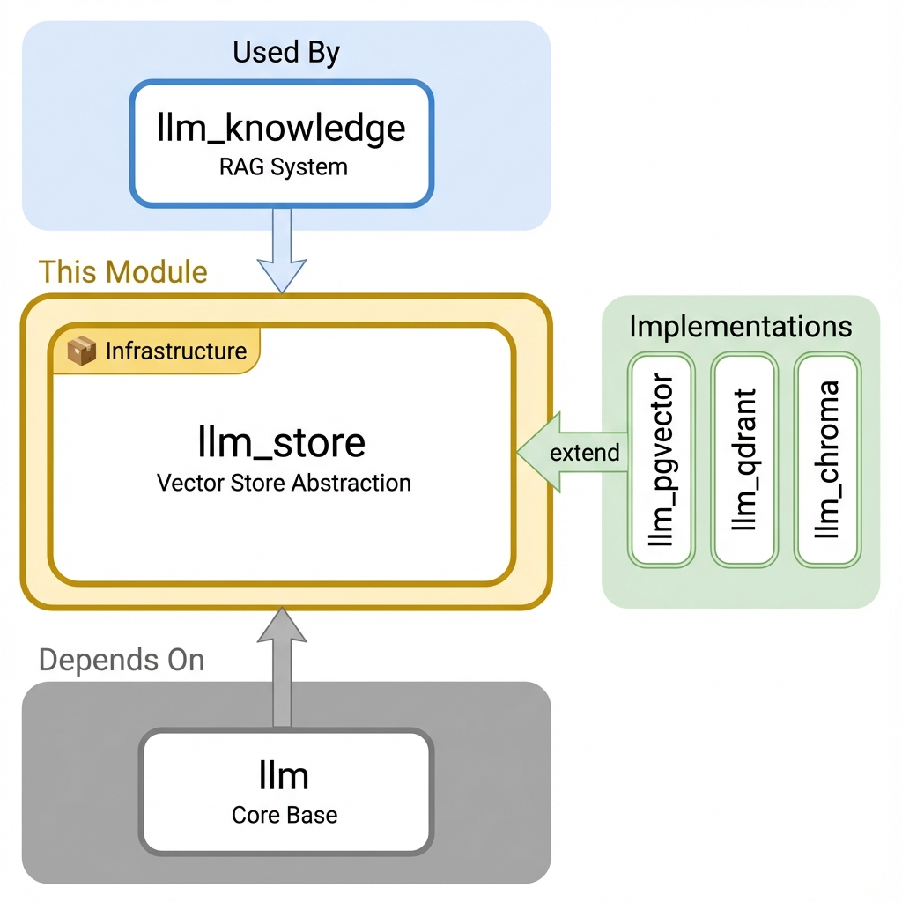

==========================================
LLM Vector Store Base for Odoo
==========================================

Comprehensive vector database abstraction layer providing unified interfaces for similarity search, embeddings storage, and RAG capabilities.

**Module Type:** 📦 Infrastructure

Installation
============

What to Install
---------------

This module is typically **auto-installed** as a dependency. You rarely need to install it directly.

**For RAG/Knowledge Base features:**

.. code-block:: bash

    # Install knowledge module with a vector store
    odoo-bin -d your_db -i llm_knowledge,llm_pgvector

Auto-Installed Dependencies
---------------------------

These are pulled in automatically:

- ``llm`` (core infrastructure)
- ``mail`` (Odoo messaging)

Choose a Vector Store Implementation
------------------------------------

+----------------+---------------------------+-----------------------------------+
| Module         | Best For                  | Requirements                      |
+================+===========================+===================================+
| ``llm_pgvector`` | Production (recommended) | PostgreSQL 14+ with pgvector     |
+----------------+---------------------------+-----------------------------------+
| ``llm_qdrant``   | Large-scale deployments  | Qdrant server                    |
+----------------+---------------------------+-----------------------------------+
| ``llm_chroma``   | Development/testing      | None (embedded)                  |
+----------------+---------------------------+-----------------------------------+

Common Setups
-------------

+----------------------------------+----------------------------------------------------------+
| I want to...                     | Install                                                  |
+==================================+==========================================================+
| Add RAG to my AI assistant       | ``llm_knowledge`` + ``llm_pgvector`` + ``llm_assistant`` |
+----------------------------------+----------------------------------------------------------+
| Simple document search           | ``llm_knowledge`` + ``llm_chroma``                       |
+----------------------------------+----------------------------------------------------------+
| High-performance vector search   | ``llm_knowledge`` + ``llm_qdrant``                       |
+----------------------------------+----------------------------------------------------------+

Overview
========

The LLM Vector Store Base module serves as the foundation for vector database operations in the Odoo LLM ecosystem. It provides a provider-agnostic interface that enables seamless integration with various vector databases while maintaining consistent APIs and performance optimizations.

Core Capabilities
-----------------

- **Multi-Provider Support** - Unified interface for ChromaDB, pgvector, Qdrant, and other vector stores
- **Collection Management** - Abstract models for organizing and managing vector collections
- **Vector Operations** - Insert, search, update, and delete operations with metadata support
- **Index Management** - Automatic index creation and optimization for performance
- **RAG Integration** - Seamless integration with knowledge base and retrieval systems

Key Features
============

Provider Abstraction Framework
------------------------------

**Unified Interface Across Vector Stores:**

.. code-block:: python

    class LLMStore(models.Model):
        _name = "llm.store"
        _description = "LLM Vector Store"

        def _dispatch(self, method, *args, **kwargs):
            """Dynamic dispatch to service-specific implementation"""
            service_method = f"{self.service}_{method}"
            if hasattr(self, service_method):
                return getattr(self, service_method)(*args, **kwargs)

Collection Management
---------------------

.. code-block:: python

    # Create collection
    collection = env['llm.store.collection'].create({
        'name': 'knowledge_base',
        'store_id': store.id,
        'dimension': 1536,  # OpenAI embedding dimension
        'distance_metric': 'cosine'
    })
    collection.create_collection()

    # Insert vectors
    collection.insert_vectors(
        vectors=[[0.1, 0.2, 0.3, ...]],
        metadata=[{'document_id': 123}],
        ids=['doc_123']
    )

    # Search vectors
    results = collection.search_vectors(
        query_vector=[0.2, 0.3, 0.4, ...],
        limit=5
    )

API Reference
=============

Core Store Methods
------------------

.. code-block:: python

    # Collection management
    def create_collection(self, name, dimension, metric='cosine'):
        """Create new vector collection"""

    def delete_collection(self, name):
        """Delete vector collection"""

    # Vector operations
    def insert_vectors(self, collection, vectors, metadata=None, ids=None):
        """Insert vectors into collection"""

    def search_vectors(self, collection, query_vector, limit=10, filter=None):
        """Search similar vectors"""

    def update_vectors(self, collection, ids, vectors=None, metadata=None):
        """Update existing vectors"""

    def delete_vectors(self, collection, ids=None, filter=None):
        """Delete vectors from collection"""

Technical Specifications
========================

Module Information
------------------

- **Name**: LLM Vector Store Base
- **Version**: 18.0.1.0.0
- **Category**: Technical
- **License**: LGPL-3
- **Dependencies**: ``llm``, ``mail``
- **Author**: Apexive Solutions LLC

Key Models
----------

- **``llm.store``**: Base vector store configuration
- **``llm.store.collection``**: Vector collection management

Performance Characteristics
---------------------------

+------------------+----------+-----------+-----------+
| Operation        | ChromaDB | pgvector  | Qdrant    |
+==================+==========+===========+===========+
| Insert Speed     | Good     | Excellent | Excellent |
+------------------+----------+-----------+-----------+
| Search Speed     | Good     | Very Good | Excellent |
+------------------+----------+-----------+-----------+
| Scalability      | Limited  | Good      | Excellent |
+------------------+----------+-----------+-----------+
| Setup Complexity | Low      | Medium    | Medium    |
+------------------+----------+-----------+-----------+

Related Modules
===============

- **``llm``** - Base infrastructure and provider framework
- **``llm_knowledge``** - Knowledge base and RAG integration
- **``llm_chroma``** - ChromaDB vector store implementation
- **``llm_pgvector``** - PostgreSQL pgvector implementation
- **``llm_qdrant``** - Qdrant vector store implementation

Resources
=========

- `GitHub Repository <https://github.com/apexive/odoo-llm>`_
- `Architecture Overview <../OVERVIEW.md>`_

License
=======

This module is licensed under `LGPL-3 <https://www.gnu.org/licenses/lgpl-3.0.html>`_.

----

*© 2025 Apexive Solutions LLC. All rights reserved.*
