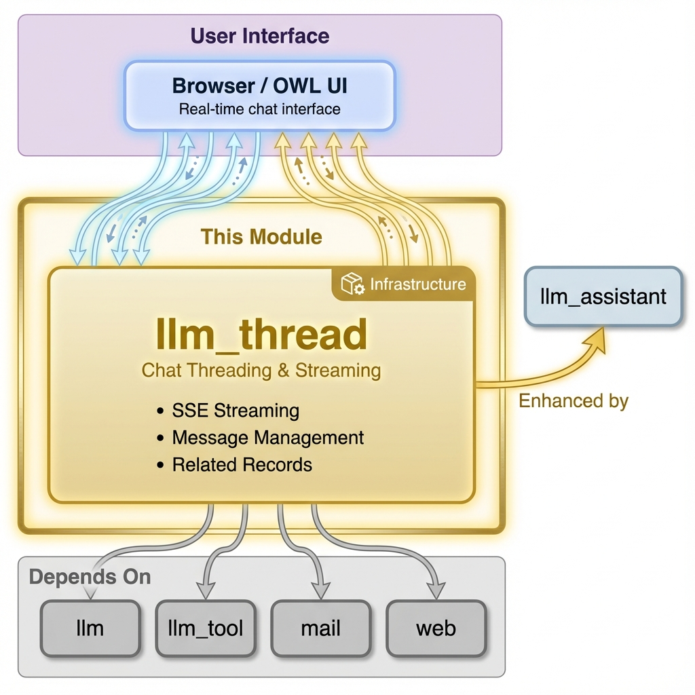

# LLM Thread - Easy AI Chat for Odoo

Real-time AI chat interface for Odoo with streaming responses, tool execution, and seamless integration with Odoo's mail system.

**Module Type:** 📦 Infrastructure



## Installation

### What to Install

This module is typically **auto-installed** as a dependency of `llm_assistant`.

**For a complete AI chat experience:**

```
llm_assistant + llm_openai (or other provider)
```

### Auto-Installed Dependencies

These are pulled in automatically:

- `llm` (core infrastructure)
- `llm_tool` (function calling)
- `mail`, `web` (Odoo base)

### Common Setups Using This Module

| I want to...           | Install                                  |
| ---------------------- | ---------------------------------------- |
| Chat with AI in Odoo   | `llm_assistant` + `llm_openai`           |
| Chat with local AI     | `llm_assistant` + `llm_ollama`           |
| Add RAG to chat        | Above + `llm_knowledge` + `llm_pgvector` |
| Connect external tools | Above + `llm_mcp_server`                 |

## What is LLM Thread?

LLM Thread brings conversational AI directly into Odoo. It provides the chat UI and message management layer, bridging the frontend interface with the generation engine (`llm_generate`), provider APIs, and tool execution framework. Chat with AI models from OpenAI, Anthropic, Ollama, and dozens of other providers through a familiar messaging interface. Link conversations to any Odoo record, enable tool execution, and get streaming responses in real-time.

**Note**: This module provides the chat interface and orchestration. Actual LLM generation is handled by `llm_generate` module, while `llm_assistant` provides assistant configurations and prompt templates.

## Requirements

- **Python**: 3.10+
- **Odoo**: 18.0
- **Dependencies**: `llm`, `llm_tool`, `mail`, `web`
- **Python Packages**: `emoji`, `markdown2`

## Quick Start

### 1. Install Module

```bash
odoo-bin -d your_db -i llm_thread
```

### 2. Configure Provider

Navigate to **LLM → Configuration → Providers**:

- Create a new provider (e.g., OpenAI)
- Enter your API key
- Click **Fetch Models** to import available models

### 3. Start Chatting

**Option A - Dedicated Chat Interface:**

- Go to **LLM → Chat**
- Click **New** to create a conversation
- Select provider and model
- Start chatting!

**Option B - From Any Record:**

- Open any record (Sale Order, Contact, etc.)
- Click the **AI** button in the chatter
- Chat with AI in context of that record

### 4. Enable Tools (Optional)

To let AI execute actions in Odoo:

- Install `llm_assistant` module for full functionality
- In your thread, select available tools
- AI can now search records, create data, and more

## Architecture

```
┌─────────────┐     EventSource      ┌──────────────┐      ┌─────────────┐
│   Browser   │ ←──────────────────→ │  Controller  │ ───→ │ llm.thread  │
│  (OWL UI)   │   Streaming SSE      │  /generate   │      │   Model     │
└─────────────┘                      └──────────────┘      └──────┬──────┘
                                                                  │
                                     ┌──────────────┐      ┌──────▼──────┐
                                     │ mail.message │ ←─── │ llm.provider│
                                     │  (storage)   │      │   (API)     │
                                     └──────────────┘      └─────────────┘
```

- **Protocol**: Server-Sent Events (SSE) for real-time streaming
- **Endpoint**: `/llm/thread/generate` (GET with streaming response)
- **Storage**: Messages stored in `mail.message` with `llm_role` field
- **Locking**: PostgreSQL advisory locks prevent concurrent generation

### Message Flow

1. User sends message → POST to `/llm/thread/update`
2. Message saved with `llm_role="user"` via `message_post()`
3. Generation triggered → `/llm/thread/generate` endpoint
4. Advisory lock acquired for thread (prevents duplicate generation)
5. Provider streams response chunks via SSE
6. Each chunk updates message body in real-time
7. Final message saved with `llm_role="assistant"`
8. Lock released, UI updated via bus notification

## Features

### Streaming Responses

Real-time token-by-token streaming for immediate feedback:

```python
# Controller streams responses via SSE
@http.route("/llm/thread/generate", type="http", auth="user")
def llm_thread_generate(self, thread_id, message=None, **kwargs):
    headers = {
        "Content-Type": "text/event-stream",
        "Cache-Control": "no-cache",
        "X-Accel-Buffering": "no",  # Disable nginx buffering
    }
    return Response(
        self._llm_thread_generate(...),
        direct_passthrough=True,
        headers=headers,
    )
```

### Related Records

Link any conversation to an Odoo record for context:

```python
# Create thread linked to a sale order
thread = env['llm.thread'].create({
    'name': 'Sales Discussion',
    'provider_id': provider.id,
    'model_id': model.id,
    'model': 'sale.order',  # Related model
    'res_id': sale_order.id,  # Related record ID
})

# Access related record in prompts via RelatedRecordProxy
context = thread.get_context()
# context['related_record'].get_field('partner_id')  → Customer name
# context['related_record'].get_field('amount_total')  → Order total
```

### Tool Integration

Enable AI to execute tools during conversation:

```python
# Add tools to thread
thread.tool_ids = [(6, 0, [
    search_tool.id,
    create_tool.id,
    calendar_tool.id,
])]

# AI can now call these tools during generation
# Tools are executed with user's permissions
```

### Concurrent Generation Protection

PostgreSQL advisory locks prevent race conditions:

```python
# Automatic locking during generation
with thread._generation_lock():
    # Only one generation can run per thread
    for chunk in provider.chat_stream(messages):
        yield chunk
# Lock automatically released
```

## API Reference

### Thread Management

```python
# Create new thread
thread = env['llm.thread'].create({
    'name': 'My Chat',
    'provider_id': env.ref('llm_openai.provider_openai').id,
    'model_id': env['llm.model'].search([('name', '=', 'gpt-4')], limit=1).id,
})

# Post user message
thread.message_post(
    body="Hello, AI!",
    llm_role="user",
    author_id=env.user.partner_id.id,
)

# Post assistant message (markdown auto-converted to HTML)
thread.message_post(
    body="**Hello!** How can I help you today?",
    llm_role="assistant",
    author_id=False,
)

# Post tool result
thread.message_post(
    llm_role="tool",
    body_json={
        "tool_call_id": "call_123",
        "function": "search_records",
        "result": {"count": 5, "records": [...]}
    },
)
```

### Generation

```python
# Generate response (returns generator for streaming)
for event in thread.generate(user_message_body="What's my order status?"):
    if event['type'] == 'message_create':
        print("New message:", event['message'])
    elif event['type'] == 'message_chunk':
        print("Chunk received")
    elif event['type'] == 'message_update':
        print("Final message:", event['message'])
    elif event['type'] == 'error':
        print("Error:", event['error'])
```

### Context Access

```python
# Get thread context with related record
context = thread.get_context()

# Access in Jinja templates
# {{ related_record.get_field('name') }}
# {{ related_record.get_field('partner_id') }}
# {{ related_model }}  → 'sale.order'
# {{ related_res_id }}  → 123
```

## HTTP Endpoints

### Generate Response

```
GET /llm/thread/generate?thread_id=123&message=Hello
```

**Response**: Server-Sent Events stream

```
data: {"type": "message_create", "message": {...}}

data: {"type": "message_chunk", "message": {...}}

data: {"type": "message_update", "message": {...}}

data: {"type": "done"}
```

### Update Thread

```
POST /llm/thread/<thread_id>/update
Content-Type: application/json

{"name": "New Thread Name", "model_id": 456}
```

## Frontend Components

### LLM Chat Container

Main chat interface component using Odoo's mail components:

```javascript
// llm_chat_container.js
import { Component } from "@odoo/owl";
import { Thread } from "@mail/core/common/thread";
import { Composer } from "@mail/core/common/composer";

export class LlmChatContainer extends Component {
  static template = "llm_thread.LlmChatContainer";
  static components = { Thread, Composer };
  // ...
}
```

### Thread Header

Provider/model selection and thread configuration:

```javascript
// llm_thread_header.js - Select provider, model, and tools
```

### Related Record Picker

Link threads to any Odoo record:

```javascript
// llm_related_record.js - Search and link records
```

### Tool Message Display

Display tool execution results:

```javascript
// llm_tool_message.js - Render tool call results
```

## Integration Examples

### Add AI Chat to Custom Module

```python
class MyModel(models.Model):
    _inherit = 'my.model'

    def action_open_ai_chat(self):
        """Open AI chat linked to this record"""
        thread = self.env['llm.thread'].create({
            'name': f'AI Chat - {self.display_name}',
            'provider_id': self.env.ref('llm_openai.provider_openai').id,
            'model_id': self.env['llm.model'].search(
                [('name', '=', 'gpt-4o')], limit=1
            ).id,
            'model': self._name,
            'res_id': self.id,
        })

        return {
            'type': 'ir.actions.client',
            'tag': 'llm_chat_action',
            'params': {'thread_id': thread.id},
        }
```

### Programmatic Chat

```python
# Use AI programmatically without UI
thread = env['llm.thread'].create({
    'name': 'Automated Analysis',
    'provider_id': provider.id,
    'model_id': model.id,
})

# Post question
thread.message_post(body="Analyze this data: ...", llm_role="user")

# Generate response (requires llm_generate + llm_assistant)
for event in thread.generate():
    if event['type'] == 'message_update':
        response = event['message']['body']
        break

print(response)
```

## Troubleshooting

**Chat not responding?**

- Check provider API key is valid
- Verify model is active and supports chat
- Check Odoo logs for API errors

**Streaming not working?**

- Ensure nginx has `X-Accel-Buffering: no` header
- Check browser console for SSE connection errors
- Verify `/llm/thread/generate` endpoint is accessible

**"Currently generating" error?**

- Previous generation may have failed without releasing lock
- Wait a moment or refresh the page
- Check if another tab is generating for same thread

**Tools not executing?**

- Verify `llm_generate` and `llm_assistant` modules are installed
- Check tool is active and assigned to thread
- Ensure user has permission to execute tool actions

**Messages not appearing?**

- Check browser console for JavaScript errors
- Verify bus notifications are working
- Ensure user has access to `llm.thread` records

## Security

- **User-scoped**: Each thread belongs to a user
- **ACL enforced**: Standard Odoo access control rules apply
- **Tool permissions**: Tools execute with user's permissions
- **No shared locks**: Advisory locks are per-thread, per-session

## Related Modules

- **`llm`** - Base infrastructure and provider management
- **`llm_generate`** - Core generation engine that handles actual LLM API calls
- **`llm_assistant`** - AI assistants with prompt templates and configurations
- **`llm_tool`** - Function calling framework
- **`llm_tool_demo`** - Example tools implementation
- **`llm_openai`** - OpenAI provider (GPT-4, etc.)
- **`llm_ollama`** - Local model deployment
- **`llm_knowledge`** - RAG integration for context-aware responses

## Resources

- [GitHub Repository](https://github.com/apexive/odoo-llm)
- [Module Documentation](doc/index.rst)
- [Changelog](changelog.rst)

## License

This module is licensed under [LGPL-3](https://www.gnu.org/licenses/lgpl-3.0.html).

---

_© 2025 Apexive Solutions LLC. All rights reserved._
