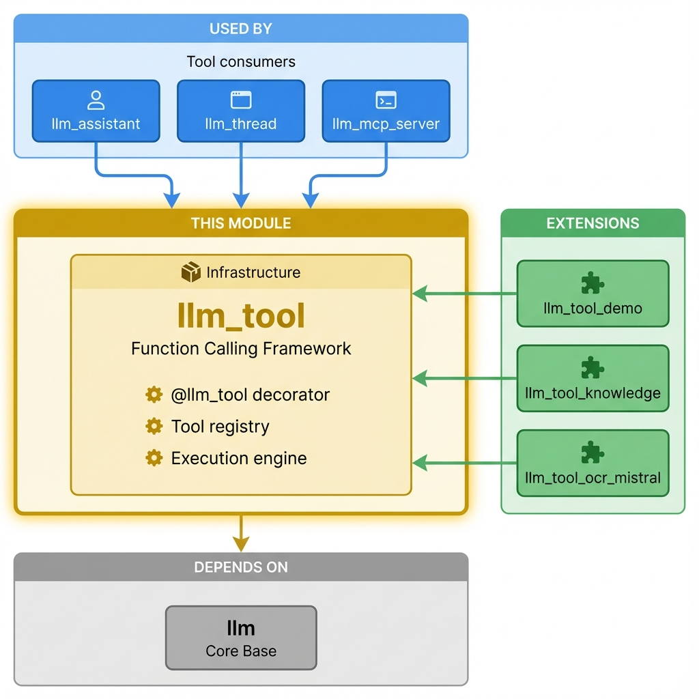

==============================
LLM Tool - AI Function Calling
==============================

Enable LLMs (ChatGPT, Claude, etc.) to interact with your Odoo database by calling tools/functions.

**Module Type:** 📦 Infrastructure

Installation
============

What to Install
---------------

This module is typically **auto-installed** as a dependency of ``llm_assistant`` or ``llm_thread``.

**For AI with function calling:**

.. code-block:: bash

    odoo-bin -d your_db -i llm_assistant,llm_openai

Auto-Installed Dependencies
---------------------------

These are pulled in automatically:

- ``llm`` (core infrastructure)

Optional Enhancements
---------------------

+------------------------+------------------------------------+
| Module                 | Adds                               |
+========================+====================================+
| ``llm_tool_demo``       | 6 example tools to learn from     |
+------------------------+------------------------------------+
| ``llm_tool_knowledge``  | RAG search tool for LLMs          |
+------------------------+------------------------------------+
| ``llm_tool_ocr_mistral``| OCR tool using Mistral            |
+------------------------+------------------------------------+

Common Setups
-------------

+--------------------------------+------------------------------------------------------+
| I want to...                   | Install                                              |
+================================+======================================================+
| AI that searches Odoo records  | ``llm_assistant`` + ``llm_openai``                   |
+--------------------------------+------------------------------------------------------+
| AI that searches documents     | Above + ``llm_knowledge`` + ``llm_tool_knowledge``   |
+--------------------------------+------------------------------------------------------+
| Expose tools to Claude Desktop | Above + ``llm_mcp_server``                           |
+--------------------------------+------------------------------------------------------+
| Learn to build custom tools    | ``llm_tool_demo``                                    |
+--------------------------------+------------------------------------------------------+

Quick Start for Developers
==========================

Using the @llm_tool Decorator (Recommended)
-------------------------------------------

**Zero boilerplate** - just decorate your method and it's automatically available to LLMs.

.. code-block:: python

    from odoo import models
    from odoo.addons.llm_tool.decorators import llm_tool

    class ResUsers(models.Model):
        _inherit = "res.users"

        @llm_tool(read_only_hint=True, idempotent_hint=True)
        def get_system_info(self) -> dict:
            """Get basic Odoo system information"""
            return {
                "database_name": self.env.cr.dbname,
                "company_name": self.env.company.name,
                "user_count": self.env["res.users"].search_count([]),
            }

**That's it!** The tool is automatically:

- Registered in the database when Odoo starts
- Available to all LLM providers (Claude, ChatGPT, etc.)
- Description extracted from docstring
- Schema generated from type hints
- Validated with Pydantic

Decorator Options
-----------------

.. code-block:: python

    @llm_tool(
        schema={...},              # Optional: Manual JSON schema
        read_only_hint=True,       # Tool only reads data
        idempotent_hint=True,      # Multiple calls have same effect
        destructive_hint=False,    # Tool modifies/deletes data
        open_world_hint=False,     # Tool interacts with external systems
    )
    def your_tool_method(self, param1: str, param2: int = 10) -> dict:
        """Tool description - shown to the LLM"""
        pass

Using Custom Implementation
---------------------------

For tools managed via XML data files, extend ``llm.tool``:

.. code-block:: python

    class LLMTool(models.Model):
        _inherit = "llm.tool"

        @api.model
        def _get_available_implementations(self):
            implementations = super()._get_available_implementations()
            implementations.append(("my_custom_tool", "My Custom Tool"))
            return implementations

        def my_custom_tool_execute(self, param1, param2=None):
            """Execute your custom tool logic"""
            return {"result": "success"}

Then create tool records in XML:

.. code-block:: xml

    <record id="my_custom_tool" model="llm.tool">
        <field name="name">my_custom_tool</field>
        <field name="implementation">my_custom_tool</field>
        <field name="description">Tool description for the LLM</field>
        <field name="input_schema">{"type": "object", "properties": {...}}</field>
    </record>

Built-in Implementations
------------------------

- ``odoo_record_retriever`` - Search and retrieve Odoo records
- ``odoo_record_creator`` - Create new records
- ``odoo_record_updater`` - Update existing records
- ``odoo_record_unlinker`` - Delete records
- ``odoo_model_method_executor`` - Execute any model method
- ``odoo_model_inspector`` - Inspect model structure and fields

How Tools Work
==============

1. **LLM Receives Tool Definitions** - When chatting, the LLM gets available tools with schemas
2. **LLM Decides to Call Tool** - Based on user request, LLM chooses which tool to call
3. **Odoo Executes Tool** - Parameters are validated and the tool method is executed
4. **Result Returned to LLM** - Tool output is sent back to formulate a response

Tool Security
=============

.. code-block:: python

    requires_user_consent = True   # User must approve before execution
    read_only_hint = True          # Tool only reads, doesn't modify
    destructive_hint = True        # Tool may modify/delete data

Configure consent rules in: **LLM → Configuration → Tool Consent Configs**

Testing Your Tools
==================

.. code-block:: python

    # In Odoo shell or tests
    tool = env["llm.tool"].search([("name", "=", "your_tool_name")])
    result = tool.execute({"param1": "value1", "param2": 42})
    print(result)

Technical Specifications
========================

Module Information
------------------

- **Name**: LLM Tool
- **Version**: 18.0.3.0.0
- **Category**: Technical
- **License**: LGPL-3
- **Dependencies**: ``llm``
- **Author**: Apexive Solutions LLC

Key Models
----------

- **``llm.tool``**: Tool definition and execution
- **``llm.tool.consent.config``**: User consent configuration

Related Modules
===============

- **``llm``** - Base LLM infrastructure
- **``llm_thread``** - Chat interface with tool execution
- **``llm_assistant``** - Configure assistants with specific tools
- **``llm_tool_demo``** - Example tools using ``@llm_tool`` decorator
- **``llm_mcp_server``** - Expose tools via Model Context Protocol

Resources
=========

- `GitHub Repository <https://github.com/apexive/odoo-llm>`_
- `Decorator Guide <../DECORATOR.md>`_
- `Changelog <../changelog.rst>`_

License
=======

This module is licensed under `LGPL-3 <https://www.gnu.org/licenses/lgpl-3.0.html>`_.

----

*© 2025 Apexive Solutions LLC. All rights reserved.*
