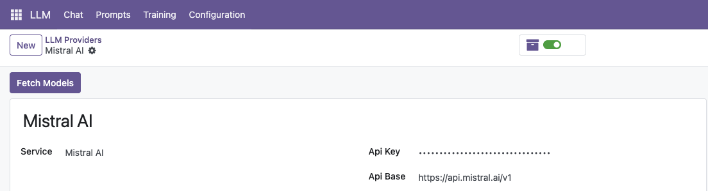
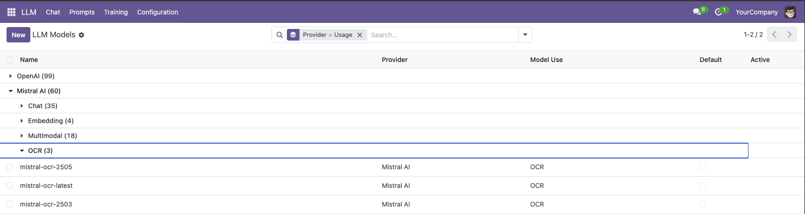
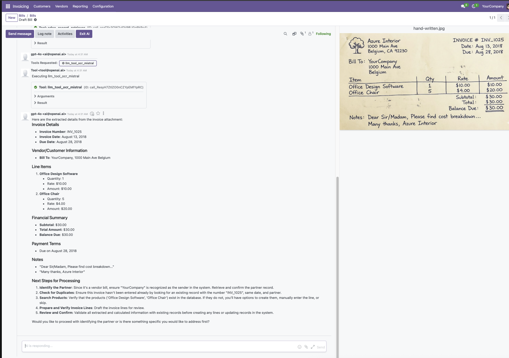

==================
Mistral OCR Tool
==================

Extract text from images and PDFs using Mistral AI vision models. Standalone OCR tool that any LLM assistant can use.

**Module Type:** 🔌 Extension (OCR Tool)

Architecture
============

::

    ┌───────────────────────────────────────────────────────────────┐
    │                    AI Consumers                               │
    │  ┌─────────────┐  ┌─────────────┐  ┌─────────────────────┐   │
    │  │llm_assistant│  │  llm_letta  │  │   llm_mcp_server    │   │
    │  └──────┬──────┘  └──────┬──────┘  └──────────┬──────────┘   │
    └─────────┼────────────────┼────────────────────┼──────────────┘
              └────────────────┼────────────────────┘
                               ▼
                  ┌───────────────────────────────────────────┐
                  │   ★ llm_tool_ocr_mistral (This Module) ★  │
                  │      Extract Text from Attachment Tool    │
                  │  👁️ Vision OCR │ 📄 PDF │ 🖼️ Images       │
                  └─────────────────────┬─────────────────────┘
                                        │
                            ┌───────────┴───────────┐
                            ▼                       ▼
        ┌───────────────────────────┐   ┌───────────────────────────┐
        │         llm_tool          │   │        llm_mistral        │
        │    (Tool Framework)       │   │    (Mistral Provider)     │
        └───────────────────────────┘   └───────────────────────────┘

Installation
============

What to Install
---------------

**For OCR tool access:**

.. code-block:: bash

    odoo-bin -d your_db -i llm_tool_ocr_mistral

Auto-Installed Dependencies
---------------------------

- ``llm`` (core infrastructure)
- ``llm_tool`` (tool framework)
- ``llm_mistral`` (Mistral AI provider)

Why Use This Module?
--------------------

+----------------+--------------------------------+
| Feature        | llm_tool_ocr_mistral           |
+================+================================+
| **OCR**        | 👁️ Mistral vision models       |
+----------------+--------------------------------+
| **Formats**    | 📄 PDF, PNG, JPG, WEBP         |
+----------------+--------------------------------+
| **Standalone** | 🔧 Tool for any assistant      |
+----------------+--------------------------------+
| **MCP Ready**  | 🔌 Works with external clients |
+----------------+--------------------------------+

Common Setups
-------------

+----------------+---------------------------------------------------------+
| I want to...   | Install                                                 |
+================+=========================================================+
| Invoice OCR    | ``llm_assistant_account_invoice`` (includes this)       |
+----------------+---------------------------------------------------------+
| Chat + OCR     | ``llm_assistant`` + ``llm_openai`` +                    |
|                | ``llm_tool_ocr_mistral``                                |
+----------------+---------------------------------------------------------+
| Claude + OCR   | ``llm_mcp_server`` + ``llm_tool_ocr_mistral``           |
+----------------+---------------------------------------------------------+

What is OCR?
============

Optical Character Recognition (OCR) converts images and scanned documents into machine-readable text. This module provides an LLM tool that:

1. **Reads** invoices, receipts, bills, and scanned documents
2. **Extracts** text from handwritten notes and product labels
3. **Parses** screenshots, photos, and multi-page PDFs

Unlike traditional OCR, Mistral's vision models understand document structure and context, providing accurate text extraction even from low-quality or handwritten sources.

Installation
============

Prerequisites
-------------

- **Odoo**: 18.0 or higher
- **Required Modules**: ``llm``, ``llm_mistral``, ``llm_tool``
- **Mistral API Key**: Get one from `Mistral AI Platform <https://console.mistral.ai/>`_

Install Steps
-------------

1. **Install required Odoo modules:**

   .. code-block:: bash

      odoo-bin -d your_database -i llm,llm_mistral,llm_tool,llm_tool_ocr_mistral

2. **Configure Mistral Provider:**

   - Navigate to **LLM → Providers → Mistral**
   - Add your Mistral API key
   - Click **Sync Models**

3. **Restart Odoo server**

Quick Start
===========

1. Verify OCR Tool is Available
--------------------------------

After installation, verify the tool is registered:

- Navigate to **LLM → Tools**
- Look for **Extract Text from Attachment (OCR)**
- Status should be **Active**

2. Use OCR Tool
---------------

The tool is simple - give it an attachment ID, get back parsed text:

.. code-block:: python

   # Example: Extract text from attachment ID 5
   thread = env['llm.thread'].create({})
   thread.message_post(body="Please parse attachment ID 5")
   thread.generate_response()

   # Assistant uses extract_text_from_attachment tool
   # Returns extracted text from the PDF/image

How It Works
============

Tool Interface
--------------

**Tool Name:** ``extract_text_from_attachment``

**Input:**

.. code-block:: json

   {
     "attachment_id": 5
   }

**Output:**

.. code-block:: json

   {
     "text": "Extracted text content from the document...",
     "filename": "invoice.pdf"
   }

Usage Pattern
-------------

1. LLM assistant needs to extract text from a document
2. Assistant knows the attachment ID (from prompt, user message, or search)
3. Assistant calls ``extract_text_from_attachment(attachment_id=5)``
4. Tool uses Mistral vision model to parse the attachment
5. Returns clean, structured text

Usage Examples
==============

Basic OCR
---------

.. code-block:: python

   # Create thread and ask to parse attachment
   thread = env['llm.thread'].create({})
   thread.message_post(body="Parse attachment ID 123 and tell me the vendor name")
   thread.generate_response()

Invoice Processing
------------------

.. code-block:: python

   # Invoice assistant with OCR
   thread = env['llm.thread'].create({
       'model': 'account.move',
       'res_id': 456,
   })
   thread.message_post(body="Extract data from attachment ID 789")
   thread.generate_response()

With llm_assistant_account_invoice Module
------------------------------------------

The invoice assistant module uses this OCR tool automatically:

.. code-block:: bash

   # Install invoice assistant (includes OCR)
   odoo-bin -d your_database -i llm_assistant_account_invoice

The assistant's prompt template tells it about attachments and how to use OCR.

Screenshots
===========

1. Configure Mistral Provider
------------------------------

*Add API key and sync models*

2. OCR Models Available
-----------------------

*Mistral vision models ready for parsing*

3. Text Extraction
------------------

*Clean text extracted from invoices and receipts*

Supported Document Types
=========================

- **Invoices and Receipts**: Vendor, date, amount, line items
- **Scanned Documents**: Paper archives to searchable text
- **Handwritten Notes**: Forms, signatures, meeting notes
- **Product Labels**: Codes, descriptions, barcodes
- **Screenshots**: Error messages, UI text
- **Multi-page PDFs**: All pages processed automatically

Use with External Clients (MCP)
================================

Install ``llm_mcp_server`` to expose this tool to external AI clients:

.. code-block:: bash

   odoo-bin -d your_database -i llm_mcp_server

**Compatible Clients:**

- Claude Desktop
- Cursor IDE
- Claude Code CLI
- Any MCP-compatible application

**Example from Claude Desktop:**

::

   You: "Parse attachment ID 123 from my Odoo database"
   Claude: [Uses OCR tool via MCP] "The document contains..."

This lets you extract text from Odoo attachments without opening Odoo UI.

Configuration
=============

Tool Consent
------------

Configure in **LLM → Tools → Extract Text from Attachment**:

- **Always Allow** (recommended) - Auto-execute
- **Ask Permission** - User approves each use
- **Never Allow** - Disable tool

Troubleshooting
===============

**Tool not found?**

- Check ``llm_tool_ocr_mistral`` is installed
- Verify tool is active in **LLM → Tools**

**No vision models?**

- Go to **LLM → Providers → Mistral**
- Click **Sync Models**
- Verify API key is valid

**Extraction fails?**

- Verify attachment ID exists
- Check attachment is image/PDF format
- Ensure Mistral vision model is available

**Poor quality results?**

- Use higher resolution images (300+ DPI)
- Ensure text is legible
- Try clearer scan/photo

Related Modules
===============

**llm_assistant_account_invoice** - Invoice data entry assistant using OCR

**llm_knowledge_mistral** - Knowledge base with OCR support

**llm_mcp_server** - Expose tools to external MCP clients

Documentation
=============

- **GitHub**: https://github.com/apexive/odoo-llm

License
=======

LGPL-3 - https://www.gnu.org/licenses/lgpl-3.0.html

---

**© 2025 Apexive Solutions LLC**
